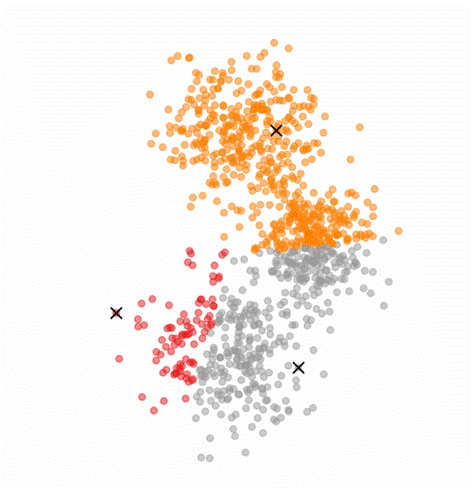

# PCA-guided K-means

A reproductibility benchmark on various K-means initialization method, in particular PCA-guided search, as explained in the paper "PCA-guided search for K-means" by Qin Xu et al.

This is a student project made by Timothé Boulet, Thomas Lemercier and Théo Saulus.



# Table of Contents

-   [**Installation**](#installation)
-   [**Run the benchmark**](#run-the-benchmark)
    -   [Launch a run](#launch-a-run)
    -   [Configuration](#configuration)
-   [**Datasets used**](#datasets-used)
    -   [Datasets available](#datasets-available)
    -   [Synthetic datasets configurations used in our paper](#synthetic-datasets-configurations-used-in-our-paper)
    -   [Visualize the datasets](#visualize-the-datasets)
    -   [Adding a new dataset](#adding-a-new-dataset)
-   [**Algorithms implemented**](#algorithms-implemented)
-   [**Metrics**](#metrics)
-   [**Visualize the results**](#visualize-the-results)
    -   [WandB](#wandb)
    -   [Tensorboard](#tensorboard)
    -   [Command line](#command-line)
    -   [CSV files](#csv-files)

# Installation

Clone the repository, create a venv and install the requirements :

```bash
git clone https://github.com/tboulet/PCA-guided-K-means.git
cd PCA-guided-K-means
python -m venv venv
source venv/bin/activate # or venv/Scripts/activate on Windows
pip install -r requirements.txt
```


# Run the benchmark

### Launch a run

For running the K-Means initialization algorithm `algo_name` on the dataset `dataset_name`, run the following command:

```bash
python run.py algo=algo_name dataset=dataset_name
```

For example, to run the PCA Guided Search (whose tag is ``PCA_GuidedSearch``) method for initializing K-means on the MNIST dataset (`mnist`), run the following command:

```bash
python run.py algo=PCA_GuidedSearch dataset=mnist
```

The list of available initialization algorithms and datasets are specified below.


### Configuration

We use Hydra as our configuration manager. You can modify the configuration of the benchmark by modifying the `configs/config_default.yaml` file, or you can override the configuration by specifying the corresponding field in the command line. For example :

```bash
python run.py n_iterations=50
```

By default, algorithm ``R1`` will be used on the dataset `iris`.


# Datasets used

The datasets used in the original paper are the following:
- AT&T Face
- MNIST
- Binary Alphabet
- Coil20

We did reuse these datasets, and included the IRIS and the CIFAR10 datasets. We also included synthetic dataset created on the fly, in order to evaluate the robustness of the algorithms to various dataset parameters such as dimension, standard deviation, overlap, etc.

For downloading the datasets other than IRIS and the synthetic datasets, you will need to run the corresponding script in the `load_datasets_scripts` folder, as specified below.


### Datasets available

Datasets currently available in the code are the following:
- `iris` : The Iris dataset
- `att` : The AT&T Face dataset. To load the dataset, you will need to first download it in Kaggle at https://www.kaggle.com/datasets/kasikrit/att-database-of-faces and place the s1-s40 folders in `./data/at&t_data` and then run ``load_datasets_scripts\load_att.py`` (from the root directory of this repo). This will download the dataset and save it in ``data/`` as an .npy file.
- `mnist` : The MNIST dataset. To load the dataset, you will need to run ``load_datasets_scripts\load_mnist.py``.
- `ba` : The Binary Alphabet dataset. To load the dataset, you will need to run ``load_datasets_scripts\load_binary_alphabet.py``.
- `coil` : The Coil20 dataset. To load the dataset, you will need to run ``load_datasets_scripts\load_coil20.py``.
- `cifar10` : The CIFAR10 dataset. To load the dataset, you will need to run ``load_datasets_scripts\load_cifar10.py``.
- `synth` : A synthetic dataset that will be created on the fly. You can control parameters of this dataset through the config file of the `synth` dataset.

### Synthetic datasets configurations used in our paper

Concerning the synthetic datasets, we also included our hand-crafted configurations that we used in our paper. Those synthetic datasets are the following:
- ``gauss1`` (10 clusters) and ``gauss2`` (1000 clusters) : gaussian clusters.
- ``ellipsoidal`` : ellipsoidal clusters in high dimension.
- ``laplace`` : heavy-tailed Laplacian clusters.
- ``uniform`` : short-tailed uniform clusters.
- ``nested`` : nested clusters (some clusters are generated inside other clusters).
- ``bridging`` :  a tricky bridg-
ing dataset, where two distinct clusters are connected by
a linear sequences of points.

### Visualize the datasets

You can visualize the datasets by running the following command:

```bash
python visualize_datasets.py dataset=dataset_name
```

This will plot the dataset in a 2D space, using the TSNE (default), PCA or LDA dimensionality reduction methods. The config of this visualization can be found in ``configs/visualization_config.yaml``.

### Adding a new dataset

For adding a new dataset, you need to :
- code a class that implements the `datasets.base_dataset.BaseDataset` interface, i.e. that implements the get_x_data() and get_y_data() methods, which returns `numpy.ndarray` objects of shape `(n_samples, n_features)` and `(n_samples,)` respectively.
- add the dataset in the `datasets/__init__.py` file, in the `algo_name_to_AlgoClass` dictionary, with the key being the name of the dataset, and the value being the class you just coded.
- add its config file in `configs/datasets/<dataset_name>.yaml`, specifying the field `name`, `n_classes` and `config`.


# Algorithms implemented

The K-means initialization methods implemented are the following:

- `R1` : Random (R1 version), we partition randomly the dataset into `k` clusters, and take the centroids of these clusters as the initial centroids.
- `R2` : Random (R2 version), we sample `k` points uniformly at random from the dataset, they are the initial centroids.
- `KMeansPP` : K-means++ algorithm. The
first centroid is chosen randomly, and subsequent centroids are
selected with a probability proportional to the square of the shortest
distance from a data point to the closest centroid.
- `PCA_GuidedSearch` : PCA-guided search, as described in the paper "PCA-guided search for K-means" by Qin Xu et al. The algorithm is the following:
    - We first compute the PCA of the dataset, and project the dataset on the first `k` principal components.
    - We then run the K-means++ algorithm on the projected dataset.
    - We obtain our clusters according to our projected dataset. We finally apply the K-means algorithm on the original dataset, with the centroids obtained from those clusters as initial centroids.
- `HAC` : Hierarchical Agglomerative Clustering. The HAC algorithm is applied on the dataset : employing a "bottom-
up" approach, begins with numerous small clusters and iteratively
merges the closest clusters until a single cluster is formed. The centroids of the `k` clusters obtained are taken as the initial centroids of an additional K-means algorithm.
- `KKZ` : The KKZ algorithm initiates by selecting the first centroid with the maximum norm. Successive centroids are chosen based on the maxi-
mal distance from previously selected centroids to candidate points,
iteratively repeating this process until K centroids are identified


# Metrics

We used several clustering metrics to evaluate the quality of the initialization. The explanations of those metrics and their purposes can be found in our paper.

The metrics used to measure the quality of the initialization are the following:
- `distortion` : The distortion of the clustering, i.e. the sum of the squared distances between each point and its centroid. The best distortion through the iterations is also logged as the `best_distortion` tag.
- `silhouette` : The silhouette score of the clustering. It  measures how similar each point is to its own cluster compared to other clusters.
- ``davies_bouldin`` : The Davies-Bouldin index. It measures the average similarity between each cluster and its most similar one.
- ``calinski_harabasz`` : The Calinski-Harabasz index. It is the ratio of the sum of between-clusters dispersion and the sum of within-cluster dispersion for all clusters.
- ``number_of_iterations_for_convergence`` : The number of iterations needed for the K-Means algorithm to converge. Convergence is reached when the centroids do not change anymore.


# Visualize the results

### WandB

If you specify the ``do_wandb`` flag to ``True`` in the config file, the results will be logged in WandB.

You can find the results of our benchmark at https://wandb.ai/projet13/K-means%20initialization%20Benchmark. We advise you to group the runs by the ``dataset_name`` tag (to be able to only display the runs of a specific dataset), and then by the ``algo_name`` tag (to group runs by algorithm).

### Tensorboard

If you specify the ``do_tensorboard`` flag to ``True`` in the config file, the results will also be logged in Tensorboard. You can launch Tensorboard by running the following command:

```bash
tensorboard --logdir=tensorboard
```

### Command line

If you specify the ``do_cli`` flag to ``True`` in the config file, the results will also be logged in the command line.

### CSV files 

The metric tags that are listed in the ``to_log_in_csv`` field in the config will be logged as CSV files in ``logs/<run name>/metrics.csv``. You can then use those CSV files to plot the results in your favorite plotting software.